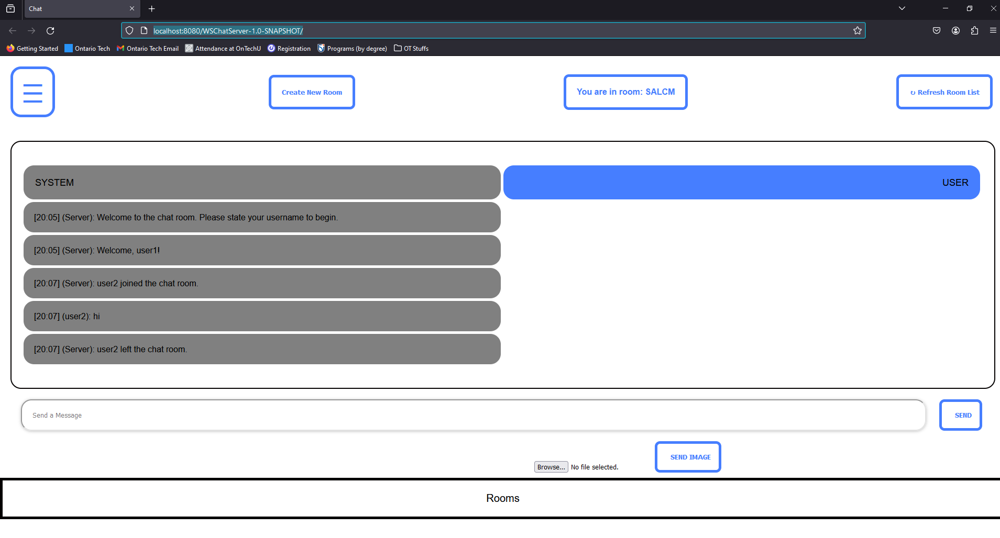
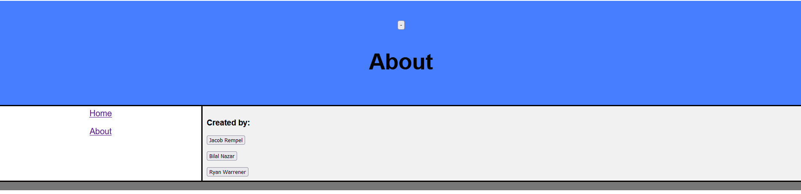

# ------- PROJECT INFORMATION --------

## Group Members: Jacob Rempel, Ryan Warrener, Bilal Nazar

# Media
## Demo Video
Click this -->

## Screenshots

Showcasing the leave message

The about page

### Summary
Within this project, we were able to establish a chat server that is able to handle multiple clients within a
chatroom and allow users the ability to create multiple chatrooms. The application allows for randomly generated
chatroom codes, making chatrooms only visible to the select users/client within that chatroom. The application 
greets and announces whenever a new user/client has joined. Timestamps and the username will be printed along the 
sent messages. The user/client interacts with a beautifully displayed UI allowing them to see current chatrooms
and access information about the contributors of the application. 

# ---------- IMPROVEMENTS ------------

The improvements that were made to the UI was:

    * Including a "Menu Navigation" Bar, located at the top-left corner of the screen, 
    clicking on it would display the NAV, allowing for a more clean and easy user experince.

    * Animations were added to the buttons when the users cursor were to hover over them. Clicking the "Menu" 
    icon created an animation of the sidebar popping out from the side.

    * A "Send" Button was implemented to allow the user to send messages by simply clicking a button.

    * A "Refresh Room List Button" was implemented to allow the user to know about the current chatrooms taking
    place

The improvements that were made to the Functionality of the program was:

    * A functional "Send" Button was implemented to allow the user to send messages by simply clicking a button.

    * A functional "Refresh Room List Button" was implemented to allow the user to know about the current chatrooms taking place

    * Chat room history gets displayed when a new user enters a chatroom, allowing the user to keep up with the 
    previous conversation. The history is always tracked, not just when everyone leaves the room.

    * Whenever a user wants to enter a chatroom they are required to create a new user account

    * The chatroom is able to send and recieve images between users, allowing for a more personal experience.

    * The chat is displayed as a table, allowing us to differentiate messages the user sends as well as display pictures.

# ---------- HOW TO RUN --------------

### Step 1)
Open the Github of the assignment and copy the link of the assignment code.

### Step 2)
First find a suitable folder to store the assignment code. Then clone the repo with the link.

### Step 3)
After successfully loading the assignment folder, access the ChatServer.java by going through
w24-csci2020u-assignment02-rempel-nazar-warrener/src/main/java/com/example/webchatserver/ChatServer.java

Once in the file edit the Run Configurations of the file by setting up a Local Glassfish Server running 
GlassFish 7.0.11. Then assign the JRE to JDK 21, specifiy the Domain as domain1, set up the initial URL to be
http://localhost:8080/WSChatServer-1.0-SNAPSHOT/. Then go to Deployment and select the artifact "WSChatServer: war exploded". 
Finally, apply and save these changes. It is also worth noting, we sometimes manually load the index.html by going to:
http://localhost:8080/WSChatServer-1.0-SNAPSHOT/index.html. For some reason, the servlet would not serve an up-to-date index.html file.
On my laptop, this bug happens but my desktop is unaffected. 

### Step 4)
#### The following steps detail more on how to use the application, you are welcome to mess around with it as it is very intuitive.
Click Run File. The Server would have successfully opened, automatically displaying the index.html file.

### Step 5)
Begin by clicking on the button "Create New Room", this button will set up a new chatroom for the user. 

### Step 6)
Afterward, the user will be shown a message asking to state a name. After typing in a name, the user can either
press the "SEND" button or hit "Enter" on their keyboard. Finally, the chatroom will display a welcome message
stating a new user has entered the server and the user can now freely send messages within chatroom using the 
given input bar. At the top it will display what room the user is currently in. If a user would like to send 
an image they can select "Choose File" below the input bar. A user can select whatever image they would like uploaded, then press the "Send Image" button.

### Step 7)
To add a user, copy and paste the URL to a new tab. From here, the user can either click "Create 
New Room" to start another chatroom or click "Refresh Room List" (this also happens when the page loads) which will display the currently active
chatrooms below the "message input bar". The user can then select which room they would like to enter. After
selecting the room they would like to join, Step 6) will repeat but this time chat history will be retrieved
and the conversation can continue with the new client. When one of the users leaves, closing the tab. Other 
users within the chatroom will be notified that the user has left.

### Step 8)
There will be a "Menu" icon on the top left of the screen. Clicking on it will allow you to navigate to the 
"About" page

# ---------- OTHER RESOURCES ----------

Resources that were used to assist with the solution were from the StackOverflow forums that assisted 
with troubleshooting the backend and frontend of the websites. The use of Lab Codes and In-Class codes were
used to help develop many aspects of the backend. The use of MDN Web Docs and w3Schools was used to help with 
the creation of the Front-End.

# -------- CONTRIBUTION REPORT --------

| Name          | Area Worked On | Contribution Percentage |
|---------------|----------------|-------------------------|
| Jacob Rempel  | Back-End       | 1/3                     |
| Bilal Nazar   | Front-End      | 1/3                     |
| Ryan Warrener | Front-End      | 1/3                     |

## A Note On Commits
A lot of the commits were done by Jacob, however a lot of the time (like writing this file) Ryan and Bilal helped
tremendously. The group's work distribution was very even across each member.